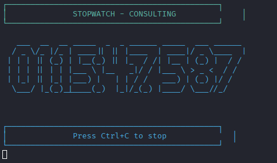
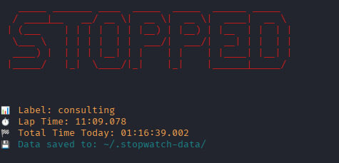
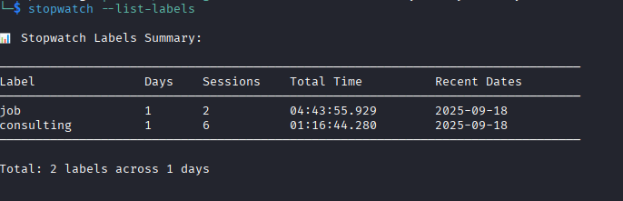

# 🕐 Large Stopwatch

A feature-rich terminal stopwatch with large display, resume functionality, and label-based time tracking. Perfect for productivity tracking, exercise timing, and project management.

## ✨ Features

- **Large Visual Display**: ASCII art time display using figlet
- **Resume Functionality**: Continue timing from where you left off
- **Label-Based Tracking**: Organize and track time by labels/categories
- **Daily Storage**: Automatic persistence with daily organization
- **Multiple Display Modes**: Standard and compact views
- **Session Analytics**: Track individual sessions and cumulative time
- **Cross-Platform**: Works on Linux, macOS, and Windows

## 📸 Screenshots





## 🚀 Installation

### Global Installation (Recommended)

```bash
npm install -g large-stopwatch
```

### Local Development Setup

```bash
# Clone the repository
git clone https://github.com/your-username/large-stopwatch.git
cd large-stopwatch

# Install dependencies
npm install

# Link for global use
npm link

# Make binaries executable
chmod +x bin/stopwatch.js
chmod +x bin/fancy-stopwatch.js
```

## 🎯 Usage

### Basic Commands

```bash
# Start a basic stopwatch
stopwatch

# Start with compact display
stopwatch --compact

# Start silently (no initial messages)
stopwatch --silent
```

> **Note**: Fancy/colorful display modes are currently broken and under maintenance.

### Resume Functionality

```bash
# Resume from specific time (various formats supported)
stopwatch 30.5              # 30.5 seconds
stopwatch 2:30.5            # 2 minutes 30.5 seconds  
stopwatch 1:15:30.5         # 1 hour 15 minutes 30.5 seconds
```

### Label-Based Time Tracking

```bash
# Start/resume tracking for a specific label
stopwatch --label "work"
stopwatch --label "exercise"
stopwatch --label "study"

# Track time with labels
stopwatch --label "coding"

# List all labels and their statistics
stopwatch --list-labels
```

### Command Aliases

The package provides the following commands:

- `stopwatch` / `lsw` - Main stopwatch command

> **Note**: Fancy display features (`--fancy`, `fancy-stopwatch`, `fsw`) are currently broken and under maintenance.

## 🏷️ Label System

The label system allows you to:

- **Auto-resume**: When you start a label, it automatically resumes from today's accumulated time
- **Daily tracking**: Each day creates a separate session log
- **Session management**: Track individual work sessions (lap times)
- **Analytics**: View total time across days, number of sessions, and recent activity

### Label Storage

Data is stored in `~/.stopwatch-data/` with daily JSON files:

```
~/.stopwatch-data/
├── 2024-09-18.json
├── 2024-09-19.json
└── 2024-09-20.json
```

### Label Analytics Example

```bash
$ stopwatch --list-labels

📊 Stopwatch Labels Summary:

────────────────────────────────────────────────────────────────────────────────
Label               Days    Sessions    Total Time          Recent Dates
────────────────────────────────────────────────────────────────────────────────
work                5       12          08:45:32.150        2024-09-20, 2024-09-19, 2024-09-18
exercise            3       6           02:30:45.890        2024-09-20, 2024-09-18, 2024-09-17
study               2       4           01:55:12.450        2024-09-19, 2024-09-18
────────────────────────────────────────────────────────────────────────────────

Total: 3 labels across 5 days
```

## 🎛️ Command Line Options

### Global Options

| Option | Alias | Description |
|--------|-------|-------------|
| `--fancy` | `-f` | Use fancy colorful display with rainbow colors |
| `--compact` | `-c` | Use compact display without figlet |
| `--silent` | `-s` | Start without initial messages |
| `--label <name>` | `-l` | Use label for storing/resuming stopwatch data |
| `--list-labels` | | List all labels across multiple days |
| `--version` | | Display version information |
| `--help` | | Display help information |

### Usage Examples

```bash
# Silent stopwatch with label
stopwatch --silent --label "deep-work"

# Compact display with label
stopwatch --compact --label "meeting"

# Resume from specific time with label (overrides stored time)
stopwatch --label "project-x" 1:30:00
```

## 🛠️ Development

### Project Structure

```
large-stopwatch/
├── bin/
│   ├── stopwatch.js          # Main CLI entry point
│   └── fancy-stopwatch.js    # Fancy display entry point (currently broken)
├── lib/
│   ├── stopwatch.js          # Core stopwatch logic
│   └── storage.js            # Label storage management
├── package.json
└── README.md
```

### Running Tests

```bash
npm test
```

### Contributing

1. Fork the repository
2. Create a feature branch: `git checkout -b feature-name`
3. Make your changes
4. Add tests for new functionality
5. Run tests: `npm test`
6. Commit changes: `git commit -am 'Add feature'`
7. Push to branch: `git push origin feature-name`
8. Submit a Pull Request

## 🔧 Technical Details

### Dependencies

- **chalk**: Terminal colors and styling
- **commander**: Command-line argument parsing
- **figlet**: ASCII art text generation

### System Requirements

- Node.js >= 14.0.0
- Terminal with color support (recommended)

### Time Format Support

The stopwatch supports multiple time input formats:

- `30.5` - Seconds with milliseconds
- `2:30.5` - Minutes:Seconds.Milliseconds
- `1:15:30.5` - Hours:Minutes:Seconds.Milliseconds

### Storage Format

Each daily file contains JSON data:

```json
{
  "work": {
    "totalTime": 28800000,
    "sessions": [
      {
        "startTime": "2024-09-20T09:00:00.000Z",
        "duration": 14400000,
        "timestamp": 1726830000000
      }
    ],
    "lastUpdated": "2024-09-20T13:00:00.000Z"
  }
}
```

## 🎨 Display Modes

### Standard Mode
Clean, professional display with ASCII borders and cyan coloring.

### Compact Mode (`--compact`)
Simplified display without figlet, perfect for smaller terminals.

> **Note**: Fancy/colorful display modes are temporarily unavailable due to technical issues.

## 📱 Use Cases

- **Productivity Tracking**: Track work sessions with different project labels
- **Exercise Timing**: Time workouts, rest periods, or specific exercises  
- **Study Sessions**: Manage study time across different subjects
- **Meeting Management**: Track meeting durations by type or client
- **Cooking**: Time recipes and cooking processes
- **Development**: Track coding sessions on different features

## 🆘 Troubleshooting

### Common Issues

**Command not found after installation**
```bash
# Re-link the package
npm unlink && npm link

# Or check if the binary is executable
chmod +x bin/stopwatch.js
```

**Fancy display features not working**
- All fancy/colorful display modes are currently broken
- Use standard mode or `--compact` for reliable operation
- Fancy features are under maintenance and will be restored in a future update

**Colors not displaying properly**
- Try using `--compact` mode for minimal styling
- Ensure your terminal supports ANSI colors

**Storage issues**
- Check permissions for `~/.stopwatch-data/` directory
- Manually create directory: `mkdir ~/.stopwatch-data`

## 📄 License

MIT License - see [LICENSE](LICENSE) file for details.

## 🤝 Support

- 🐛 **Bug Reports**: [GitHub Issues](https://github.com/your-username/large-stopwatch/issues)
- 💡 **Feature Requests**: [GitHub Discussions](https://github.com/your-username/large-stopwatch/discussions)
- 📖 **Documentation**: [GitHub Wiki](https://github.com/your-username/large-stopwatch/wiki)

## 🏆 Acknowledgments

- **figlet** - For the awesome ASCII art text generation
- **chalk** - For beautiful terminal colors
- **commander** - For elegant command-line interfaces

---

Made with ❤️ for productivity enthusiasts and terminal lovers.
